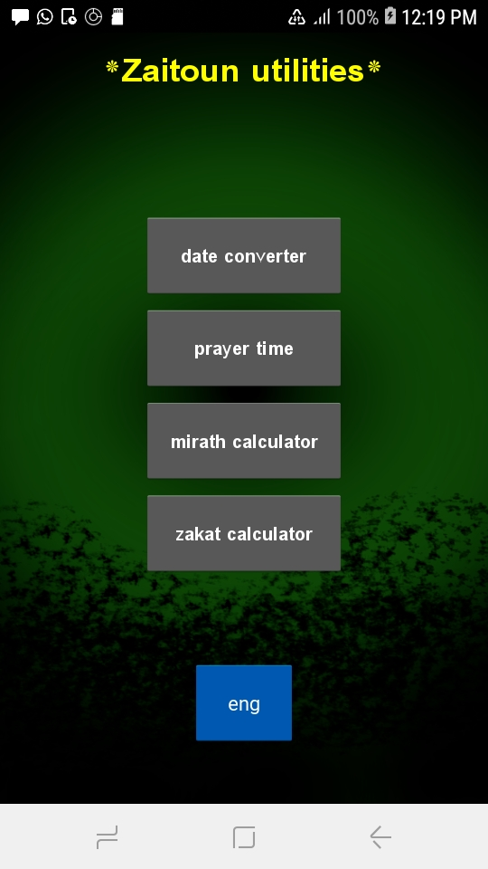
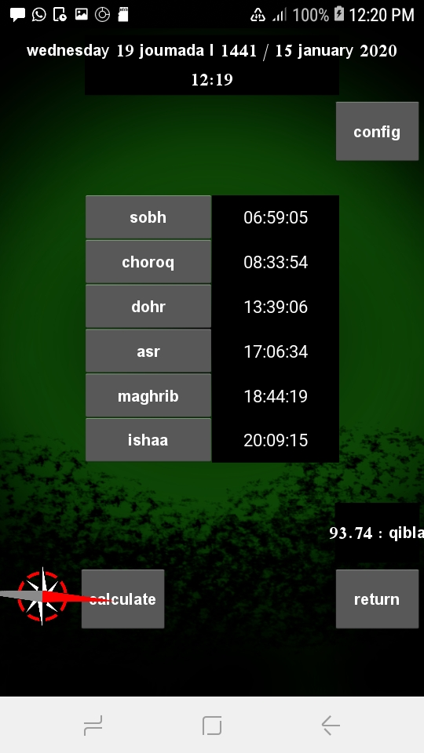
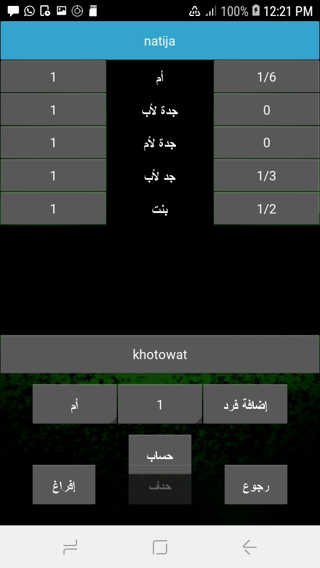

# zaitoun_utilities 

zaitoun utilities is a bundle of calculators (zakat, mirath, prayer time, date) using pyIslam librairie.

## WARNING : mirath results are incorrect for many cases, need further test and enhancing

## download

#### zaitoun_utilities_v1.0.apk (12.5 M) : [download here](https://github.com/monsef-alahem/zaitoun_utilities/raw/master/zaitoun_utilities_1.0.apk)

## utilities used

Python 3.7 + Kivy 1.9.0 : language and framework used for coding

pyIslam 2.0.0 : librarie for all calculation used in prayertime, zakat, date convertion, mirath

Piskel 0.14.0 : for drawing icons in pixelart style

Gimp 2.10 : for drawing backgrounds

Buildozer 0.39 : for apk and ios build, only for linux

## build

### run app

install kivy if not done yet

run :

main.py with python 3

$ python main.py

### mobile packaging

install buildozer if not done yet
this step is only for linux
in the app dir run:

buildozer -v android debug

## what next?

mirath calculation is still inaccruate

## contributions are welcome

if you want to fix mirath calculation please contact [the owner of pyIslam](https://github.com/abougouffa/pyIslam)
